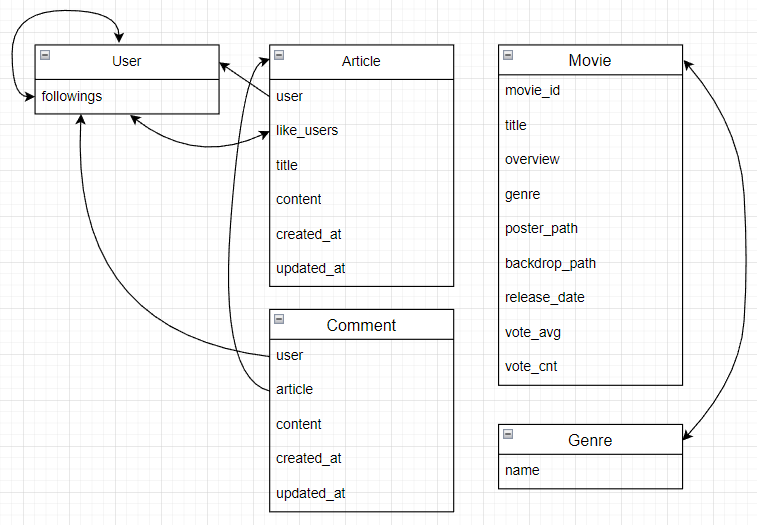
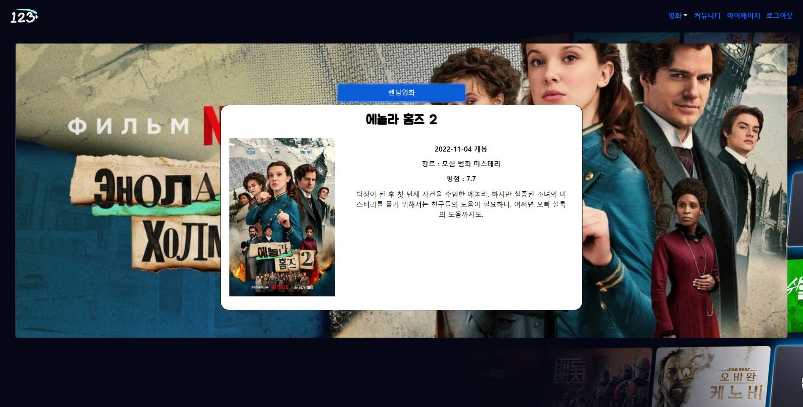
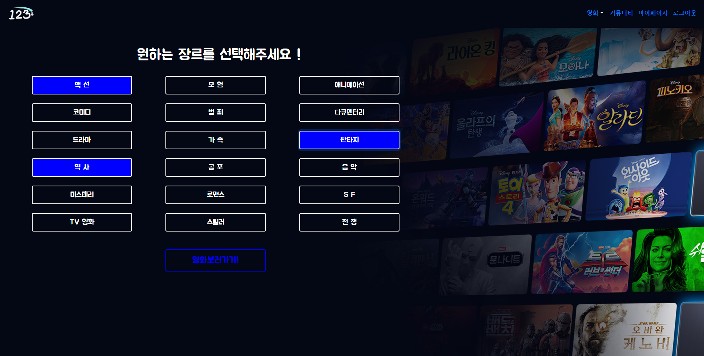
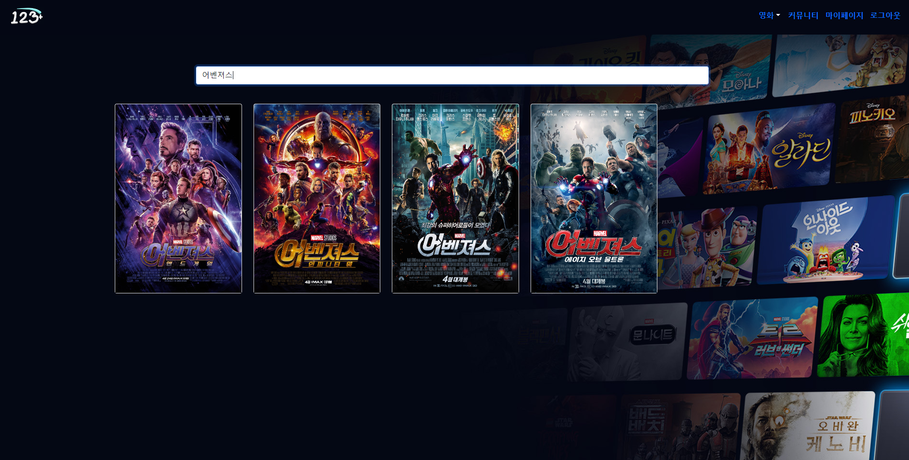
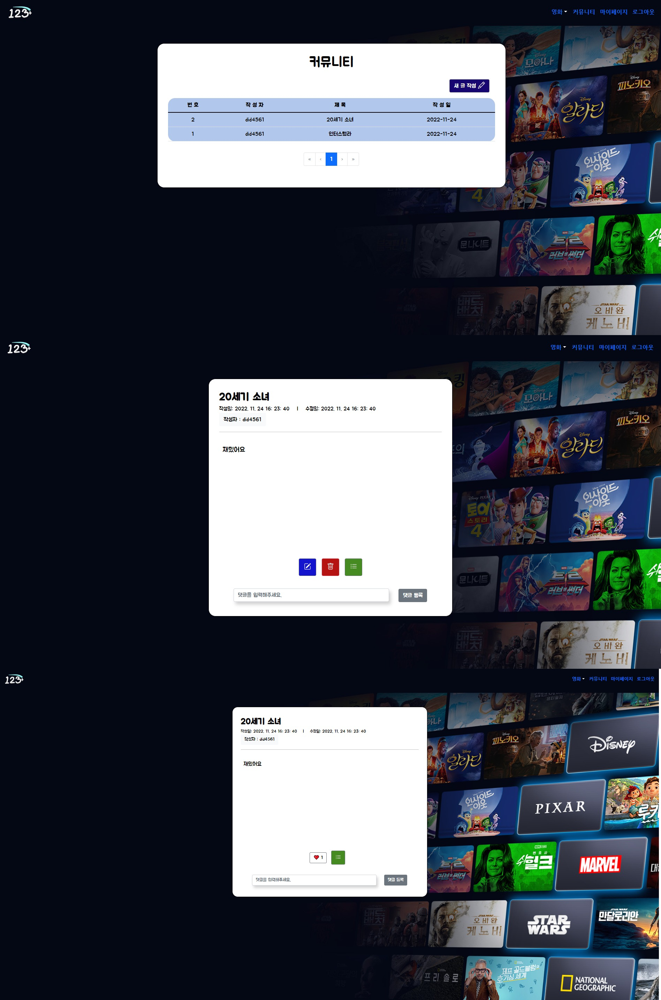
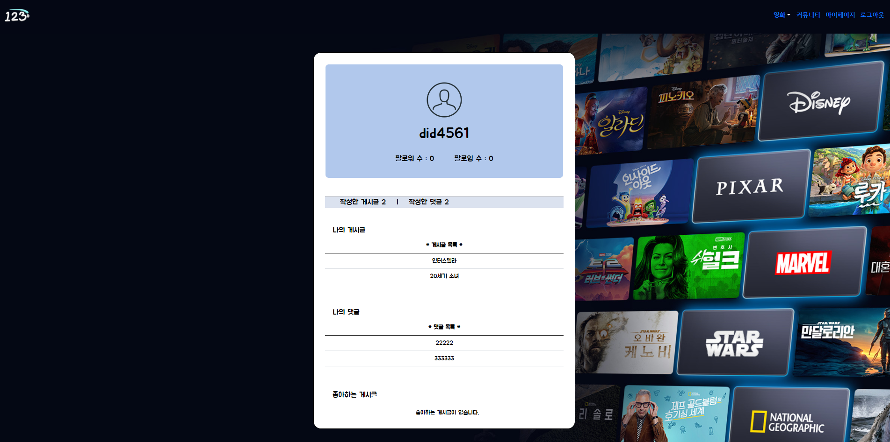

# 123weeks Final_pjt
&nbsp;
&nbsp;
&nbsp;
&nbsp;
&nbsp;
&nbsp;

&nbsp;
## i. 팀원 및 업무 분담
---
### 양석주
- 팀장
- Front(Vue, html, css) 페이지 전반 구현
- Detail, Random, Home 등 Vue 컴포넌트 기능 구현
- 데이터 추출 및 정제

### 백현웅
- Server(Django) 모델 생성 등 로직 구현
- Community 및 Account 등 Vue 컴포넌트 기능 구현 
- html, css 기능 구현

&nbsp;
## ii. 목표 서비스 구현 및 실제 구현 정도
---
### 목표 서비스 구현
- 사용자가 선택한 장르, 찜한 영화, 검색기록 등 사용자의 데이터를 활용한 머신러닝 알고리즘으로 사용자별 추천 영화 기능 구현
### 실제 구현 정도
- lodash 라이브러리를 활용한 랜덤영화추천, 장르별 영화 검색, 텍스트로 영화 검색등을 구현
- 머신러닝 알고리즘은 추후 학습하여 구현해 볼 예정

&nbsp;
## iii. 데이터베이스 모델링 (ERD)
---
&nbsp;

&nbsp;
## iv. 영화 추천 알고리즘에 대한 기술적 설명
---
1. 랜덤 영화 추천
   - lodash 라이브러리를 활용하여 전체 영화 목록에서 랜덤으로 한개의 영화를 추천해주고, 버튼을 활용하여 다른 랜덤영화를 볼 수 있도록 구현
    &nbsp;
    
    &nbsp;
2. 장르별 영화 추천
   - 사용자가 장르를 선택하면 해당 장르에 해당하는 영화목록을 반환하여 사용자가 원하는 장르의 영화를 볼 수 있도록 구현
    &nbsp;
    
&nbsp;
## v. 서비스 대표 기능에 대한 설명
---
1. 영화 검색 기능
   - 사용자가 텍스트를 입력할 때 마다 실시간으로 입력값을 보내고 store에서는 해당 검색어가 들어간 영화목록을 반환하여 검색 페이지에서 해당 텍스트가 포함된 영화목록을 사용자에게 보여준다.
   - input 창에 한글을 입력했을 때 한템포 늦게 동작하는 경우가 발생하는데 한글이 2byte로 이루어져 있기 때문이라고 하여 공식문서를 참고하여 v-model이 아닌 input 디렉티브를 사용해서 $event.target.value를 payload로 보내주었음.
    &nbsp;
    
   -  
2. 커뮤니티
   - 사용자들끼리 영화에 대한 게시글을 작성하고, 해당 게시글을 수정, 삭제, 목록으로 돌아갈 수 있는 버튼을 생성함.
    &nbsp;
    
3. 마이페이지
   - 본인이 작성한 게시글, 댓글 목록을 확인할 수 있으며 해당 게시글을 클릭하면 작성한 게시글 화면으로 전환되는 기능, 유저별로 팔로우 기능을 구현함.
    &nbsp;
    
&nbsp;
## vi. 후기
---
### 양석주
- 아무것도 없는 상태에서 필요한 모델이 무엇인지 대해서부터 시작해서 전체적인 구상을 한다는것이 생각보다 쉽지 않았고, 처음 목표로했던 결과를 다 구현하지는 못 했다.
처음 생각했던 것 보다 디테일하게 신경써야 할 부분들이 있었고, 에러가나면 어디서 에러가 났는지 찾는것도 쉽지 않았다.
Vue는 최근에 배워서 각 컴포넌트와 router, store를 동작원리대로 순서대로 따라가면서 이해하는데 나름 수월하게 했다는 생각이 들었고, django는 교육기간중 가장 오랜기간 배웠지만 serializer에 대한 이해가 부족하다고 생각해서 더 공부를 해야겠다는 생각이 들었다.
css, html은 이번에 개발자도구를 많이 보면서 진행했는데 이 스타일이 어디에 적용되는지 계속 확인하면서 html 구조를 이해하는데 도움이 되었고 실력이 향상되었다는 생각이 들었다.
또한 이번에 협업을 진행하면서 branch를 생성해서 작업하고 merge하면서 commit을 수행하는것에 대해 작동원리를 이해하는데 많은 도움이됐다.
이번 프로젝트에서 아쉬웠던점은 최초 계획했던 알고리즘을 구현하지 못했다는것과 최초에 구상을 디테일하게 하지 않았다는 점인데 알고리즘은 발표 이후에도 다시 구현할 계획이고, 구상은 다음 프로젝트를 진핼할 때에는 이번의 경험을 기회삼아 더 좋은 프로젝트를 기획해야겠다.

### 백현웅
- 처음인가 두번째 관통프로젝트때 파이썬만으로 json파일을 가지고 영화 데이터를 다뤘던 적이 엊그제 같은데, 벌써 1학기 마지막 관통프로젝트도 마치게 되었다.
원래는 추천알고리즘을 추천시스템에 대한 머신러닝 기법을 공부하여 구현할 계획이었다. 하지만 프로젝트를 시작할 즈음에 코로나에 걸리는 바람에 관련된 공부를 못하여서 구현을 못하였다.
또한 그 밖에 여러가지 기능을 구현하는데 시도하고싶었지만 기본적인 기능을 구현하는데 급급해서 다양한 시도를 하지못해 아쉬웠다. 지금 이렇게 프로젝트를 마치더라도 추천알고리즘 부분은 추천시스템을 공부하여 다시 구현할 계획이다.

